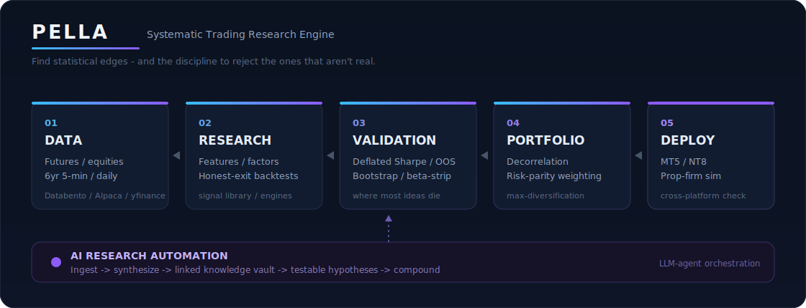
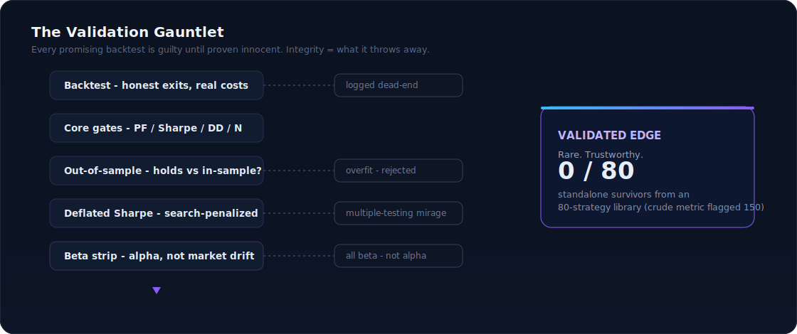
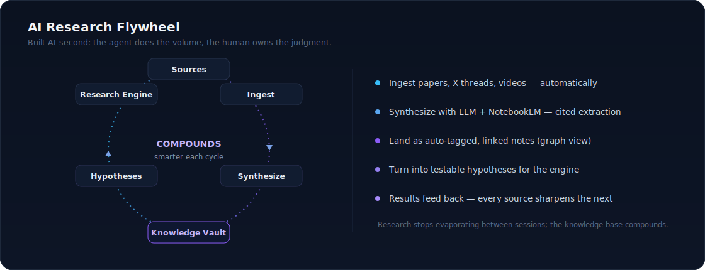
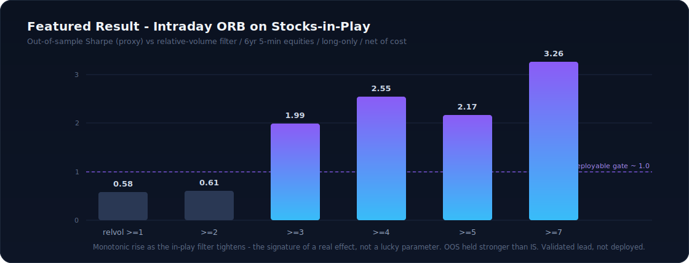
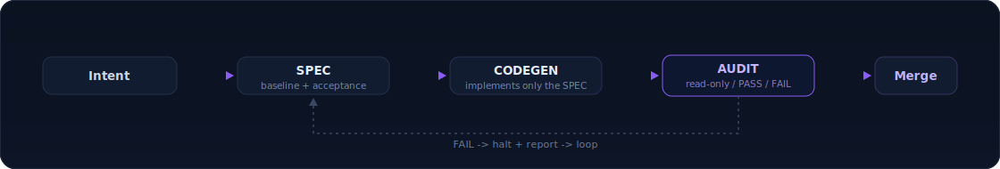

# PELLA

### Systematic Trading Research Engine

*Find statistical edges — and bring the discipline to reject the ones that aren't real.*

-8b5cf6?style=flat-square)

---

> Codename **Pella**, after the ancient capital of Macedonia. The thesis: **the strategy is the asset; the venue is just where you fight.**

An end-to-end research engine for designing, backtesting, and **statistically validating** systematic trading strategies across equities and futures. The headline isn't a magic strategy — it's the **process**: a rigorous screen that treats every promising backtest as guilty until proven innocent, plus an AI-automation layer that makes the research compound instead of evaporate.

Most "edges" are overfitting, survivorship bias, or plain market beta in a costume. This engine is built to *catch that* — Deflated Sharpe Ratios, bootstrap confidence intervals, strict out-of-sample splits, survivorship-bias-free universes, and beta-stripping — so the output is a small number of trustworthy findings instead of a large number of seductive lies.

---

## System Architecture

**Why two platforms (MT5 + NT8):** no single broker has clean data on both CFDs and futures. Building on one and porting to the other forces clean separation of strategy logic from broker quirks — and gives a built-in cross-validation layer. A strategy that holds up under tick data on Broker A *and* Broker B is far more likely to hold up live.

---

## The Validation Gauntlet

The integrity of the engine is measured by what it **throws away**. An 80-strategy library run through this screen produced **zero** standalone survivors — the crude profit-factor view had flagged 150 "winners." Catching that gap *is* the product.

---

## AI Research Flywheel

Built with **AI-second execution** — an LLM agent directed end-to-end to write the pipelines, run the analyses, and draft the synthesis, while every claim is verified at the source and judged against the gauntlet. The agent does the volume; the human owns the judgment.

---

## Featured Result — an edge that *survived*

A faithful intraday **Opening-Range Breakout on "stocks-in-play"** (high relative volume), tested on **6 years of 5-minute equity data**, long-only, with stops at the opposite side of the range and conservative stop-first exits, **net of transaction costs**. The edge **rises monotonically as the in-play filter tightens** — the signature of a real structural effect, not a lucky parameter — and held up *out-of-sample stronger than in-sample*. **Framed honestly: a validated research lead, not a deployed strategy**; open caveats (volume-feed quality, sample size at the extremes, slippage stress) are documented, not hidden.

---

## Engineering Discipline — governed AI code changes

AI tools "helpfully" rename variables and add silent logic when asked for narrow fixes — dangerous on code that handles money. A three-document contract (**SPEC → CODEGEN → AUDIT**) turns the AI from a creative collaborator into a disciplined tool that does exactly what's specified, halts when ambiguous, and audits its own work without modifying it.

---

## What's Demonstrated Here

- **Quantitative rigor** — Deflated Sharpe Ratio, bootstrap confidence intervals, walk-forward / out-of-sample validation, effective-N multiple-testing correction, survivorship-bias control, beta-vs-alpha decomposition.
- **Data engineering** — automated multi-source pipelines (Databento, Alpaca, yfinance), point-in-time universes, 6M+ bar datasets, parquet storage.
- **Portfolio construction** — correlation/decorrelation analysis, risk-parity and maximum-diversification weighting, market-neutral construction.
- **AI-native execution** — LLM-agent orchestration to build tooling and automate research, plus a self-improving ingestion → synthesis → knowledge-graph workflow.
- **Cross-platform engineering** — MQL5 (MetaTrader 5) and NinjaScript/C# (NinjaTrader 8), with honest tick-vs-bar exit validation that has caught and falsified inflated backtests.
- **Intellectual honesty** — the project's defining trait: rejecting your own best-looking results when the statistics don't hold.

---

## Repository Map

| Path | Contents |
|---|---|
| `docs/METHODOLOGY.md` | The full validation methodology |
| `docs/BUILD_JOURNAL.md` | Chronological build log — what was tried, what failed, why it pivoted |
| `tooling/` | Research, backtest, and automation tooling (methodology-level) |
| `strategies/` | Sample clean-room strategy implementations |
| `results/` | Backtest result archives with full metric capture |
| `assets/` | Diagrams |

> **Public = methodology and tooling only.** Live deployment configs, account identifiers, credentials, and exact production parameters are intentionally excluded.

---

## Status

**Active independent research.** The pipeline is the product; the strategies are samples. Documenting publicly as it's built.
