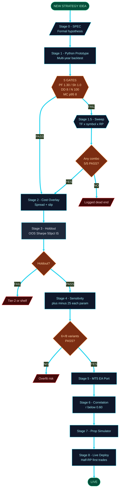
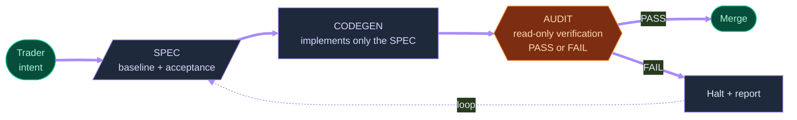
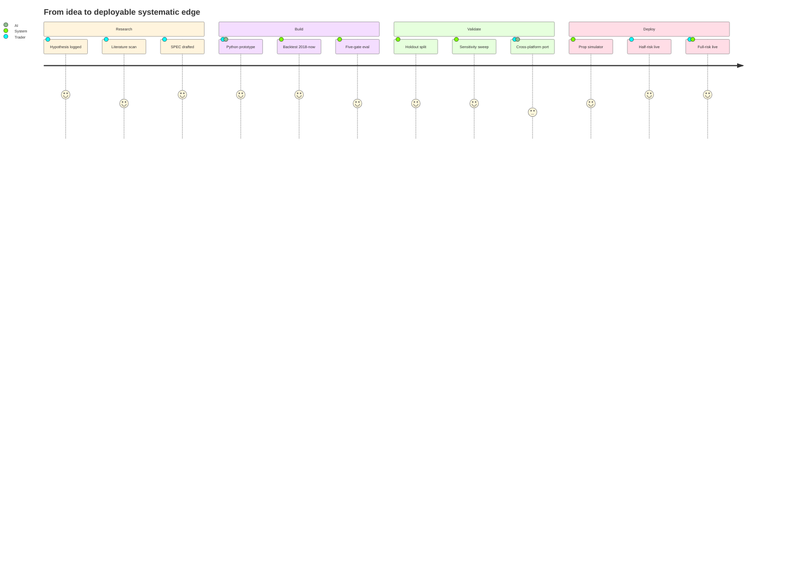

<div align="center">

# PELLA

**Algorithmic Trading Research and Backtesting Pipeline**

*Strategy is the asset. The venue is just where you fight.*


</div>

---

> Codename **Pella** after the ancient capital of Macedonia, birthplace of Alexander the Great. Short, memorable, and a reminder that strategy is the asset; the venue is just where you fight.

An end-to-end pipeline for designing, backtesting, and validating systematic trading strategies across MetaTrader 5 and NinjaTrader 8, with cross-platform validation as a hard gate before deployment.

The core thesis, arrived at after a week of fighting data-sourcing problems on the futures side:

> *"It's not about which prop firm. It's about coming up with a working model. The strategy is the asset, the prop firm is just a venue."*

That single insight pivoted the whole project from a chase-the-cheapest-prop model into a build-the-strategy-first model.

---

## System Architecture

```mermaid
%%{init: {'theme':'base', 'themeVariables': {'primaryColor':'#1e293b','primaryTextColor':'#e2e8f0','primaryBorderColor':'#06b6d4','lineColor':'#06b6d4','secondaryColor':'#0f172a','tertiaryColor':'#334155','background':'#0f172a','mainBkg':'#1e293b','clusterBkg':'#0f172a','clusterBorder':'#06b6d4','edgeLabelBackground':'#1e293b','fontSize':'14px'}}}%%
flowchart LR
    subgraph IDEAS["RESEARCH INPUTS"]
        direction TB
        I1(["Hypotheses"])
        I2(["Papers"])
        I3(["Community signals"])
    end

    subgraph PIPE["VALIDATION PIPELINE"]
        direction TB
        S0[/"Stage 0 - SPEC"/]
        S1["Stage 1 - Prototype"]
        S2["Stage 2 - Cost Overlay"]
        S3{"Stage 3 - Holdout"}
        S4{"Stage 4 - Sensitivity"}
        S5["Stage 5 - EA Port"]
        S6["Stage 6 - Correlation"]
        S7["Stage 7 - Prop Sim"]
    end

    subgraph PLAT["DUAL PLATFORM"]
        direction TB
        MT5[("MT5 Tester<br/>tick data")]
        NT8[("NT8 Tester<br/>bar data")]
    end

    subgraph OUT["DEPLOY DECISION"]
        direction TB
        REJ[/"Rejected<br/>logged"/]
        T2["Tier-2<br/>watchlist"]
        DEP(["Deploy"])
    end

    IDEAS ==> PIPE
    PIPE <==> PLAT
    PIPE ==> OUT

    classDef inp fill:#1e293b,stroke:#06b6d4,color:#e2e8f0
    classDef stage fill:#0f172a,stroke:#22d3ee,color:#a5f3fc
    classDef plat fill:#1e293b,stroke:#a78bfa,color:#ddd6fe
    classDef out fill:#0f172a,stroke:#34d399,color:#a7f3d0

    class I1,I2,I3 inp
    class S0,S1,S2,S3,S4,S5,S6,S7 stage
    class MT5,NT8 plat
    class REJ,T2,DEP out
```



**Why both platforms:** No single broker has clean data on both CFDs and futures. Building strategies on one and porting to the other forces clean separation of strategy logic from broker quirks, and produces a built-in cross-validation layer. A strategy that holds up under tick data on Broker A *and* on Broker B is more likely to hold up live.

---

## Validation Gauntlet



A strategy does not advance unless it passes ALL gates at every stage. Most published strategies don't survive the gauntlet, let alone the cross-platform check.

---

## Engineering Discipline



A four-document governance contract on every AI-assisted code change:

- **SPEC** — what is being changed, with explicit baseline and acceptance criteria
- **CODEGEN** — implements only what the SPEC declared, nothing else
- **AUDIT** — read-only verification, PASS or FAIL only

It's easy for AI tools to "helpfully" rename variables, add safety checks, or reorganize logic when asked to fix something narrow. On strategy code that handles real money, that kind of silent change is dangerous. The contract turns the AI from a creative collaborator into a disciplined tool that does exactly what's specified, halts when ambiguous, and can audit its own work without modifying it.

---

## Methodology

Every strategy goes through this pipeline. No shortcuts, no "looks fine, deploy."

1. **Research** — write the hypothesis in plain English. What macro/structural reason should this work? What would prove it wrong? Logged as one row in `research/INDEX.md`.
2. **Build** — implement the strategy. Comment the entry / exit / invalidation rules in source so future-me can read it without rerunning the code.
3. **Backtest** at tick resolution where possible. MT5 Strategy Tester with "Every tick based on real ticks" is the gold standard for forex/CFDs.
4. **Quality gates** (must pass all):
   - Profit factor > 1.3
   - Sharpe > 1.0
   - Max drawdown < 25%
   - Recovery factor > 3
   - At least 100 trades
   - Average trade hold time > 5 seconds (avoids microscalping rules)
5. **Cross-validation** — re-run the same logic on the other platform with that platform's data feed. If the result diverges meaningfully between platforms, the strategy isn't real — it's a data artifact.
6. **Simulator** — run on a paper-trading prop simulator before any live deployment.
7. **Deploy** — only after the strategy survives all of the above.

Conservative on purpose.

---

## Strategy Taxonomy

```mermaid
%%{init: {'theme':'base', 'themeVariables': {'primaryColor':'#1e293b','primaryTextColor':'#e2e8f0','primaryBorderColor':'#22d3ee','lineColor':'#22d3ee','fontSize':'13px'}}}%%
mindmap
  root((PELLA<br/>Strategy<br/>Pool))
    Trend and Breakout
      Channel breakout VIP
      Keltner breakout
      Gold trend breakout
      Turtle Soup Plus One
    Mean Reversion
      IBS pullback
      RSI(2) Connors
      Marubozu reversion
    Range and Calendar
      Inside Day NR4
      Tuesday Turnaround NDX
    Meta and Portfolio
      MetaEA orchestrator
      Correlation gate
      Capacity-aware sizer
```

---

## What's Working Today

**Pipeline is end-to-end automated.** Backtests run via HTTP / CLI, no manual clicking through Strategy Tester or Strategy Analyzer dialogs. Results land as JSON, get parsed into the result archive, and compared against the gates automatically.

**First validated backtest** is in `results/KeltnerBreakout/`. A Keltner-channel breakout strategy run against five years of forex tick data:

| Metric | Result | Gate | Pass |
|---|---|---|---|
| Profit factor | 1.16 | > 1.3 | FAIL |
| Sharpe ratio | 1.64 | > 1.0 | PASS |
| Max equity drawdown | 6.64% | < 25% | PASS |
| Recovery factor | 5.16 | > 3 | PASS |
| Total trades | 1,429 | > 100 | PASS |
| Avg trade hold | 8h 25m | > 5s | PASS |

Passes 6 of 7 gates — sharpe is strong, drawdown excellent, but profit factor misses by 0.14. **Not a deployment candidate as-is.** Useful as a known-good baseline against which to measure new strategies.

A side-effect of running this strategy: it validated the entire pipeline. Trade count produced (1,429) matched the original author's stated count (1,423) within 0.4% on the same instrument and date range. That close a match means our pipeline, our tick data feed, and our execution model all agree with theirs — i.e., when we get a strategy that *does* pass gates, the result is trustworthy.

---

## Project Journey



---

## What's Next

- Re-run a batch of additional MT5 strategies with full metric capture between each (the first batch lost intermediate metrics — pipeline-level lesson, now solved).
- Get the NT8 path producing its first complete result on Japanese Yen futures (continuous-contract rollover and 24-hour session template are the open variables).
- Once two or more strategies pass all gates on one platform, take the strongest into cross-validation.

---

## Key Files

- `docs/BUILD_JOURNAL.md` — chronological build log: what was tried, what failed, why we pivoted, what we learned
- `docs/METHODOLOGY.md` — the full version of the pipeline above
- `results/KeltnerBreakout/RESULT.md` — first validated backtest with all metrics

---

## Project Status

**Active.** Documenting publicly as I build. The pipeline is the product; the strategies are samples.
